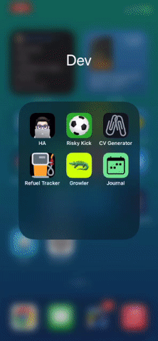

# JOURNAL

## Harvard CS50W: Web Programming with Python and JavaScript - Final Project 

## Table Of Contents

- [JOURNAL](#journal)
  - [Harvard CS50W: Web Programming with Python and JavaScript - Final Project](#harvard-cs50w-web-programming-with-python-and-javascript---final-project)
  - [Table Of Contents](#table-of-contents)
  - [Description](#description)
  - [Demo](#demo)
  - [Distinctiveness and Complexity](#distinctiveness-and-complexity)
  - [Sneak Peek of the app](#sneak-peek-of-the-app)
  - [Files](#files)
  - [Running the Application](#running-the-application)
  - [Contact](#contact)

## Description
**Journal** is a productivity-focused web application that helps users to create and manage their journal entries in an organized manner. It provides a platform for users to record their thoughts and daily experiences, enhancing their productivity and personal growth.

This full-fledged web application was built as a [final project](https://cs50.harvard.edu/web/2020/projects/final/capstone/) for [CS50's Web Programming course](https://cs50.harvard.edu/web/2020/) using Django Web Framework, JavaScript, and Bootstrap.

## Demo
Watch demo: [YouTube](...)

Test the app: [PythonAnywhere](...)

## Distinctiveness and Complexity

My final project satisfies the distinctiveness and complexity requirements because of the following elements:

1. This project is specifically focuses on "Productivity" and designed as a productivity tool. It provides users with a dedicated platform to journal their daily experiences, thoughts, and ideas in an organized manner, increasing their productivity and well-being.
2. Journal App features a dynamic & interactive calendar-like activity board which was built from scratch to motivate users to keep journaling without skipping a day. The board allows users to navigate through dates and view their journal entries for specific days in an intuitive way.
3. This project utilizes a rich text editor for entries' content field instead of a simple text field, helping users to format their entries with features like bold, italic text. This enhances the writing experience and enables users to be more expressive at journaling.
4. Journal App includes a feature that calculates and displays user's longest streak of consecutive journaling days. This functionality was built form scratch to motivate users to maintain a consistent journaling habit.
5. The app has a feature that allows users to filter their journal entries by month and year. This helps them to gain insights and reflect on their past experiences.
6. Journal App takes advantage of animations on the activity board to provide a smooth and visually appealing user experience.
7. After its submission, this project will be deployed to Python Anywhere, a platform for hosting and running Django applications. As a by-product of this deployment, MySQL will be the choice of database rather than SQLite. Moreover, the deployment will ensure that the app is accessible online, allowing users to use its features from any device with an internet connection.

## Sneak Peek of the app
  - **login view**
    

## Files

File structure (Only the files I created and modified have description.)

- `final_project`: Root directory.
    - `journal`: Application's main directory.
      - `migrations`
      - `static/journal`: Holds the static files
        - `css`
            - `styles.css`: Styling file; adds more responsiveness to the app.
        - `icons`: Contains icons for the app.
        - `js` 
          - `alerts.js`: Decides if an alert should disappear automatically.
          - `board.js`: Draws a calendar-like, current month's activity board on the index page.
          - `getEntries.js`: Contains the functions that retrieve journal entries from the backend and displays them.
          - `monthYearFilter.js`: Creates filter elements and displays them on a page where all entries are listed.
          - `script.js`: Looks for click events, acts accordingly.
          - `theme.js`: Sets theme according to user's choice.
      - `templates/journal`: Contains the HTML templates for rendering the web pages.
      - `__init__.py`
      - `admin.py`: Defines which models will be displayed in Django Admin Panel.
      - `apps.py`
      - `forms.py`: Containes Django forms used for creating and updating entries and tags.
      - `models.py`: Defines the database models.
      - `test.py`
      - `urls.py`: Specifies the URL patterns and their corresponding views.
      - `utils.py`: Contains helper function used in the app.
      - `views.py`: Contains the view functions that handle different HTTP request.
    - `main`: Project's main directory.
      - `__init__.py`
      - `asgi.py`
      - `settings.py`: project's and text editor's configuration file.
      - `urls.py`: Specifies the URL patterns and their corresponding views for project.
      - `wsgi.py`
    - `.env`: Contains private information such as Djagno's secret key.
    - `.gitignore`: Defines the files to be ignored by Git.
    - `db.sqlite3`: Database used during the development phase.
    - `manage.py`
    - `README.md`: Contains project's description and instructions.
    - `requirements.txt`: Lists all the Python packages that need to be installed to run the app.
  

## Running the Application
To run the **Journal** locally, follow these steps:

1. Make sure you have Python installed on your system.
2. Clone the project repository.
3. Open a terminal and navigate to the project's main directory.
4. Create a virtual environment (optional but recommended) and activate it.
5. Install the required Python packages by running the following command:
    ```
    pip install -r requirements
    ```
6. Apply the database migrations by executing the following command:
    ```
    python manage.py migrate
    ```
7. Start the development server:
    ```
    python manage.py runserver
    ```
8. Access the app by visiting `http://localhost:8000` in a web browser of your choice.
9. Create a new account, and start using the Journal App.

## Contact
I'm [Hakan](https://hakanayata.com). You could reach me at info@hakanayata.com